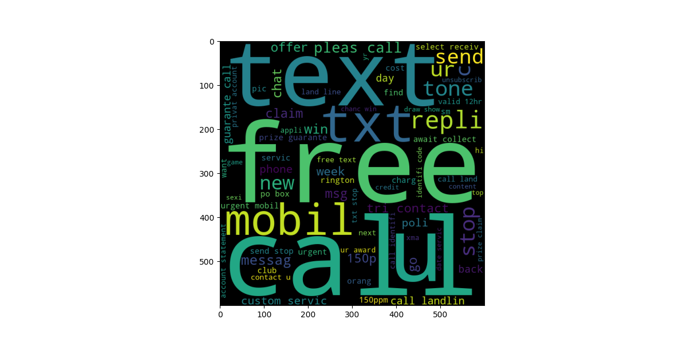
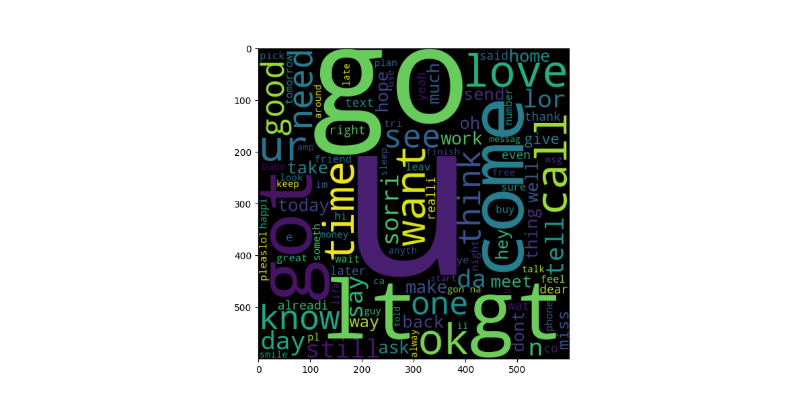
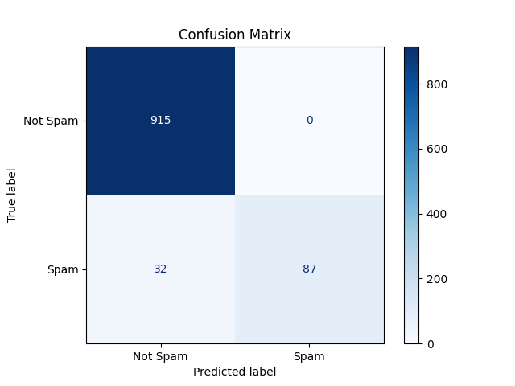

# 📩 Spam Text Detector

A simple and interactive web app built using **Streamlit** that detects whether a message is **Spam** or **Not Spam** using a machine learning model. This project showcases text preprocessing, TF-IDF vectorization, and spam classification using Scikit-learn.

---

## 🚀 Live Demo
  - Click below to try the app!
  - 👉 [spam sms detector app](https://ay3shaa-spam-sms-detector-app-2kdrtn.streamlit.app/)  

---

## 📌 Features

- 🔤 Input any text message and get instant spam classification
- 🧠 ML model trained on the popular **SMS Spam Collection Dataset**
- 📊 TF-IDF based vectorization for text input
- ✅ Deployed using Streamlit for a smooth, responsive interface

---

## 🧠 Tech Stack

- Python
- Scikit-learn
- Streamlit
- Joblib
- TfidfVectorizer

---

### 📊 Word Clouds

#### Spam

#### Ham

## 🛠️ How It Works

1. **Preprocess** the message (lowercase, remove special characters)
2. **Vectorize** using TF-IDF
3. **Classify** using a trained ML model
4. Display result as **Spam** or **Not Spam**

---

## 📈 Model Performance

- Accuracy: ~97%
- Precision: 100%
- 📊 Confusion Matrix

  
 
## 📚 Dataset Used

  - SMS Spam Collection Dataset
  - Available at: UCI ML Repository

